# stampTV's Notice

©2000-2001, [Georges-Edouard Berenger](mailto:berenger@francenet.fr), berenger@francenet.fr  
©2000, [Frank Olivier](mailto:frank@diematie.sun.ac.za), frank@diematie.sun.ac.za  
©1991-1999, Be Incorporated, All rights reserved  
Hamburg, October 7th, 2001.

### What is stampTV?

stampTV is an application for watching TV with your BeOS supported video capture card, possibly while doing something else. It now includes quite a few features: fullscreen, overlay support, named presets, audio control, wheel support and complete keyboard control.

Version 3 introduces plugins support. For more details, please see the [general documentation](stampTV's%20Plugins.html) and the [developer's documentation](Plugins%20Development.html). **_New!!! v3.0_**

### Requirements

For obvious reasons, you will need a TV capture card supported by BeOS R5 (with or without third party drivers).

### Who are the authors?

stampTV is a derivation of Be's CodyCam, started by [Frank Olivier](mailto:frank@diematie.sun.ac.za). Because he of his studies (that's what he says... :-), he didn't have the time to maintain it anymore, so he requested that I (Geb) take over stampTV and Mosaic.

A number of other developers/users have contributed to stampTV. In (apparent) chronological order:

_Frank Olivier, Christopher Lenz, Eugenia Loli, Stephan Assmus, Sylvain Tertois, Alexander Wilkens, Georges-Edouard Berenger, Attila Lendvai, Bruno G. Albuquerque_

Others contributors should be thanked for their help. They have provided answers and/or sample code:

_[John Wiggins](mailto:prok@mail.utexas.edu), [Toshihiro Kisaka](mailto:kt@pochi.iijnet.or.jp), [Shigeru Kobayashi](mailto:kotobuki@rinc.or.jp), [Carlos Hasan](mailto:chasan@acm.org), [Sean Long](mailto:sean@hailstonesoftware.com),_ 

### How does it work?

Launch stampTV. Simply double click on the application, where ever it is! A window should appear with TV content in it.

*   **_Left-click inside the window and drag around_**  
    To move the window around.
*   **_Double left-click inside the window_**  
    To switch to/from full screen mode (or press the Tab key).
*   **_Middle-click inside the window and drag in a Tracker's window or on the Desktop_**  
    To capture a frame and save it as a file. Press the Control key while doing that, and you'll be able to select which image format will be used.
*   **_Right-click inside the window_**  
    To access the popup menu. See below for a detailed description of this popup menu.

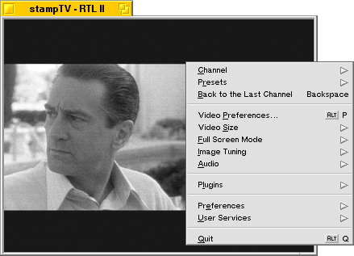

*   **_Resize the window as you wish_**  
    You can freely resize the window to your favorite size, provided the TV card can support this resolution.
*   **_Zoom the window_**  
    This will ask stampTV to find the closest ideal window size the TV card can support. If the current size is already among the natural sizes supported, then it will select the next one.
*   **_Press the left & right arrow keys_**  
    To view the next or the previous channel.
*   **_Press the up & down arrows, or Alt-M._**  
    To control the volume: increase, decrease or mute.
*   **_Press the 'return' key_**  
    To create or edit the current preset. You'll be able to choose a name and a keyboard shortcut for that preset.
*   **_Press the 'Delete' key_**  
    To delete the current preset.
*   **_Press the '+' and '-' keys_**  
    To select the next or the previous preset.

Here is a quick overview of stampTV's features as found in that popup menu:

*   **_Channel_**  
    Will allow you to select which channel you want to watch, identified by channel codes.  
    **_Next Channel_** and **_Next Channel_** will do what you expect.  
    **_Subdivide Menu_** will split the channel menu in several submenus somewhat improving the channel navigation.

    
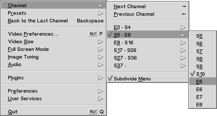

*   **_Presets_**  
    Gives quick access to the named channel presets, as well as the creation and edition of those presets. Those functions are accessible with simple keystrokes **without using any modifier** such as _Alt_, _Option_ or _Control_.  
    **_Next Preset_** and **_Next Preset_** will do what you expect.

    
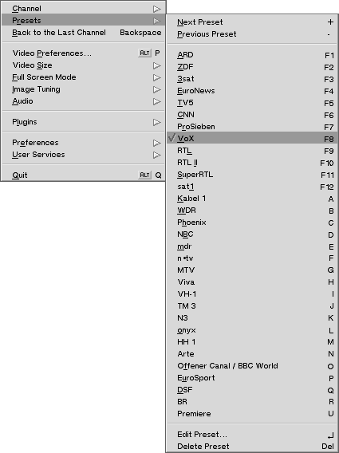

*   **_Back to the Last Channel_**  
    Brings you back to the last channel you were viewing before you last changed to an other one.  
    Very handy to switch between two programs.
*   **_Video Preferences_**  
    To change your TV card's settings using BeOS's video preferences panel.  
    Please refer to BeOS's documentation for more details.
*   **_Video Size_** **_New!!! v3.0_**  
    To select the size of the video among the tuner's best supported resolutions.

    
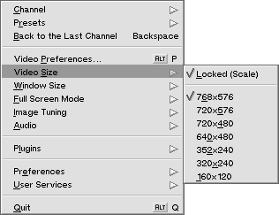

    The **_Locked (Scale)_** option gives you the possibility to choose among two different behaviors when you resize stampTV's window.  
    If the option is active (the menu item is checked), then stampTV will use a video stream of a constant size what ever the size of the window is, and will scale the frames in real-time to fit the window. The result is that the image quality is decreased, and the processor has much more work to do if it doesn't use an overlay. On the other hand, resizing is faster, and you can resize the window as you wish to almost any size.

    **_Attention!_** If an overlay is used, then your video card will do the scaling of the image. The processor won't have any work to do, and the image quality will be somewhat better, but some video cards refuse to shrink an image while others won't grow one... Resize the video to an acceptable size, or don't use the **_Locked (Scale)_** option.

    If the option is not active, when you resize the window, stampTV will ask for a new video stream with the size of the window. This prevents your processor from doing unnecessary scaling and provides the best possible image quality, but resizing won't be smooth. This is how stampTV used to always function before the **_Locked (Scale)_** option was introduced.

    The rest of the menu will allow you to select directly the size of the video you wish among the best ones your tuner can provide. If the **_Locked (Scale)_** option is not active, then the window & the video always have the same size: if you resize one, the other is also resized.

    Use the **_Locked (Scale)_** option when you want to use a plugin that requires more processing power than your computer has. For instance, select a video size of "320x240" and resize the window as you wish.

*   **_Window Size_** **_New!!! v3.0_**  
    When the **_Locked (Scale)_** option is active, then you can resize the window & the video size independently, and this menu will appear. This menu will allow you to resize the window as you wish.

    
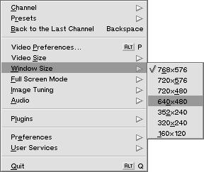

*   **_Full Screen Mode_**  
    To select which resolution & refresh rate should be used in full screen mode. The video size will be automatically selected to be as big as possible in the selected mode.  
    By using the Video Size menu while in full screen size, you can override this automatic choice.

    
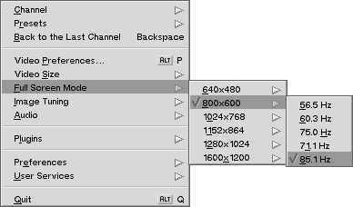

*   **_Image Tuning_**  
    To control the image quality. Provides direct access to the brightness, contrast and color saturation settings.

    
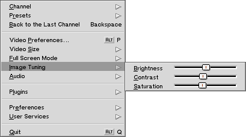

*   **_Audio_**  
    To control the TV's volume. First, make sure that you have selected the right audio control. Use the **_Source_** sub-menu to tell stampTV what controls the TV's audio. It is likely to be the "Line" or "Line out" item. That depends on your system.  
    The **_Mute_** item allows you to mute the selected source, while **_Volume_** gives fine control on the volume. You can directly interact with the slider while the popup menu is shown: just go over the slider and press the mouse button!  
    The **_Volume Up_** and **_Volume Down_** item allow you to do the same with the keyboard as well: use the up & the down arrows.

    
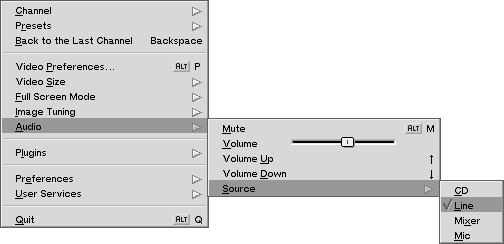

*   In the **_Plugins_** submenu, you will find: **_Improved!!! v3.0_**

    
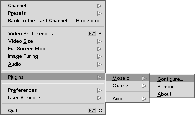

    *   **_Mosaic_** and **_Quarks_**  
        The top part of the submenu shows which plugin(s) is(are) active. In the shown case, the "Mosaic" and the "Quarks" plugins are active.

    *   **_Configure_**  
        If the plugin has a configuration panel, then this item will be present in the plugin's submenu. Select this item to access the plugins configuration window. It will also be shown is you simply select the plugin's menu item itself.
    *   **_Remove_**  
        Allows you to deactivate the designated plugin.
    *   **_About_**  
        Gives you some information about the plugin & its author.

    *   **_Add_**  
        This submenu shows which plugins are available. Select the plugin you wish to activate, and it will be added after the last currently active plugin. There is currently no way to reorder plugins, apart from removing them and re-adding them in the wished order. (Only a few of these plugins are included in stampTV's default package. You'll find the others at the [BeBits web size.](http://www.bebits.com/search?search=stamptv+plugin))

        **_Attention!_** All combinations of plugins are not acceptable. For instance, if the first plugin only produces 16 bits images and the second can only accept 32 bits images, then they can't be put one after the other. If adding a plugin produces a chain which can't work, stampTV will automatically remove the last plugin of the chain, canceling your add-operation. It won't even complain and will just remove it!

    
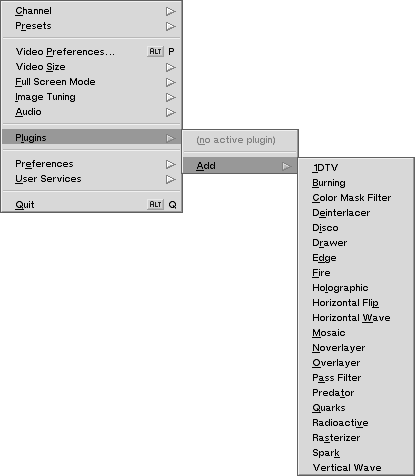

*   The **_Preferences_** submenu allows you to control which options are activated:

    
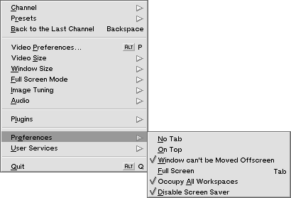

    *   **_No Tab_**  
        To choose whether stampTV's window should have a title tab.
    *   **_On Top_**  
        Will force or not stampTV's window to remain above all others.
    *   **_Window can't be Moved Offscreen_**  
        Will force stampTV's window to always remain entirely in the monitor's frame.
    *   **_Full Screen_**  
        To use the entire monitor's surface to watch TV. Press Tab or Escape to return to the normal window mode.
    *   **_Occupy All Workspaces_** **_New!!! v3.0_**  
        Let's you choose whether stampTV should be present in every workspace, or only on the current one. When the fullscreen mode is active, this option is automatically turned off.
    *   **_Disable Screen Saver_** **_New!!! v3.0_**  
        This options will prevent BeOS's screen saver to be activated while stampTV is running. Note that BeOS's ScreenSaver settings are not changed: stampTV simply simulates some user activity every once in a while to prevent the activation of the screen saver module.
*   The **_User Services_** submenu offers direct access to different Internet pages:

    
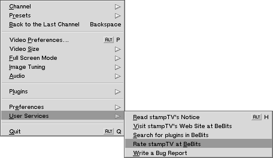

    *   **_Read stampTV's Notice_**  
        To (re)read this documentation.
    *   **_Visit stampTV's Web Site at BeBits_**  
        Opens your default web browser to [stampTV's page at BeBits](http://www.bebits.com/app/907).  
        You must be connected to the Internet for this to work.
    *   **_Search for Plugins in BeBits_**  
        Opens your default web browser, and queries [BeBits for stampTV's plugins](http://www.bebits.com/search?search=stamptv+plugin).  
        You must be connected to the Internet for this to work.
    *   **_Rate stampTV at BeBits_**  
        BeBits allows users to rate the applications listed it offers. You are invited [to express your opinion about stampTV there](http://www.bebits.com/appvote/907)!  
        You must be connected to the Internet to do so.
    *   **_Write a Bug Report_**  
        Creates a template email containing information describing your system and stampTV's versions. You can edit this email as you wish to report problems you are experiencing with this program.
*   **_Quit_**  
    Have a guess!...
*   That's it!

### Frequently Asked Questions

Many users make request for new functionalities, or request changes. This section aims at explaining why stampTV works the way it does...

*   **_Is stampTV working in overlay mode?_**  
    It is very easy to tell if stampTV successfully managed to use an overlay: Change the channel and see how the channel's name is displayed. If the name appears inside a solid rectangular black frame, then overlay is not active. If the green letters appear directly over the TV image with no black background, then an overlay is being used.
*   **_Can you implement Teletext?_**  
    Teletext support requires some driver level support, which is not implemented in Be current Bt848 driver as far as I know. Even if it was, that would most probably be a good topic for an other application!
*   **_What about remote controllers?_**  
    Support for infra red (IR) controllers is provided through [BeInControl](http://www.bebits.com/app/970). For detailed support, please refer to the [BeInControl's](http://www.bebits.com/app/970) documentation.  
    Support for remote controllers such as the one your video card has is unlikely to ever happen. This requires quite a lot of detailed information on the card itself, and support would be limited to a subset of the TV cards...
*   **_Can't you make of stampTV a replicant?_**  
    Interesting request. Versions 2.1 & 2.2 bring essential code changes which should make this easy now: everything is now handled by the view itself, leaving next to nothing into the BApplication class, and only what is strictly necessary inside the BWindow class. Preferences should work as well. Want to finish replicant support? If so, get in touch with me as soon as possible to be sure to synchronize your efforts!

### StampTV's License

StampTV's core functionality is based on a Be Sample Code, if mentioned in the corresponding file.  
Redistribution and use in source and/or binary forms, with or without modification, are permitted provided that the following conditions are met:

1.  You comply with the Be Sample Code License (included below) if you use any of the files mentioning a copyright from Be Incorporated.
2.  Redistribution of source code must retain the following copyright notice, this list of conditions, and the following disclaimer.
3.  Redistribution in binary form must reproduce the following copyright notice, this list of conditions, and the following disclaimer in the documentation and/or other materials provided with the distribution.
4.  The name of the author may not be used to endorse or promote products derived from this software without specific prior written permission.

© 2000, Frank Olivier, All Rights Reserved.  
© 2000-2001, Georges-Edouard Berenger, All Rights Reserved.

**THIS SOFTWARE IS PROVIDED BY THE AUTHOR "AS IS" AND ANY EXPRESS OR IMPLIED WARRANTIES, INCLUDING, BUT NOT LIMITED TO, THE IMPLIED WARRANTIES OF TITLE, NON-INFRINGEMENT, MERCHANTABILITY AND FITNESS FOR A PARTICULAR PURPOSE ARE DISCLAIMED. IN NO EVENT SHALL THE AUTHOR BE LIABLE FOR ANY DIRECT, INDIRECT, INCIDENTAL, SPECIAL, EXEMPLARY, OR CONSEQUENTIAL DAMAGES (INCLUDING, BUT NOT LIMITED TO, PROCUREMENT OF SUBSTITUTE GOODS OR SERVICES; LOSS OF USE, DATA, OR PROFITS; OR BUSINESS INTERRUPTION) HOWEVER CAUSED AND ON ANY THEORY OF LIABILITY, WHETHER IN CONTRACT, STRICT LIABILITY, OR TORT (INCLUDING NEGLIGENCE OR OTHERWISE) ARISING IN ANY WAY OUT OF THE USE OF THIS SOFTWARE, EVEN IF ADVISED OF THE POSSIBILITY OF SUCH DAMAGE.**

We will be glad to hear about your bug reports, problems, comments, flames, suggestions...  
You can mail us directly : [Georges-Edouard Berenger](mailto:berenger@francenet.fr) (current maintainer) or [Frank Olivier](mailto:frank@diematie.sun.ac.za) (the original author).

stampTV is provided with source code for anyone to play with. If you want to contribute with any improvement or bug fix, please let us know! We will see if it makes sense for the official distribution.

**_Please,_** before you do any major work on stampTV's source code, why don't you drop us a note to be sure efforts are not duplicate? That will prevent frustration for everyone! Everyone hates it when one discovers that what he has just written is already in the works...

### Be Sample Code License

Copyright 1991-1999, Be Incorporated.  
All rights reserved.

Redistribution and use in source and binary forms, with or without modification, are permitted provided that the following conditions are met:

1.  Redistribution of source code must retain the above copyright notice, this list of conditions, and the following disclaimer.
2.  Redistribution in binary form must reproduce the above copyright notice, this list of conditions, and the following disclaimer in the documentation and/or other materials provided with the distribution.
3.  The name of the author may not be used to endorse or promote products derived from this software without specific prior written permission.

**THIS SOFTWARE IS PROVIDED BY THE AUTHOR "AS IS" AND ANY EXPRESS OR IMPLIED WARRANTIES, INCLUDING, BUT NOT LIMITED TO, THE IMPLIED WARRANTIES OF TITLE, NON-INFRINGEMENT, MERCHANTABILITY AND FITNESS FOR A PARTICULAR PURPOSE ARE DISCLAIMED. IN NO EVENT SHALL THE AUTHOR BE LIABLE FOR ANY DIRECT, INDIRECT, INCIDENTAL, SPECIAL, EXEMPLARY, OR CONSEQUENTIAL DAMAGES (INCLUDING, BUT NOT LIMITED TO, PROCUREMENT OF SUBSTITUTE GOODS OR SERVICES; LOSS OF USE, DATA, OR PROFITS; OR BUSINESS INTERRUPTION) HOWEVER CAUSED AND ON ANY THEORY OF LIABILITY, WHETHER IN CONTRACT, STRICT LIABILITY, OR TORT (INCLUDING NEGLIGENCE OR OTHERWISE) ARISING IN ANY WAY OUT OF THE USE OF THIS SOFTWARE, EVEN IF ADVISED OF THE POSSIBILITY OF SUCH DAMAGE.**

### Known bugs & problems

*   When switching between workspaces with different color depth when overlay is in use, you may get "dirt" on the screen which you can wipe out by moving a window around.
*   Resizing the window (or zooming it) will cause a short audio interruption. This is normal: the connection with the media node is cut and re-established with buffers of the adequate new size. This guaranties that the image quality is always as good as possible because the driver always provides an image of the right side (no scaling is ever done by the app server, unlike with TV).

### To do (help & suggestions are welcomed!)

*   Replicant support.
*   Support for more remote controllers.
*   A remote controller plugin.
*   A mosaic plugin to "watch" different channels at once.
*   More plugins.

### History

#### v3.0 (October 7th, 2001)

*   Introduction of plugins! See [separate documentation](stampTV's%20Plugins.html) for details!
*   A "Video Plugins" folder is created if it doesn't exist in the "/boot/home/config/add-ons" folder. This is were your plugins should be stored. stampTV will also scan a folder called "Plugins" if it exists in stampTV's folder.
*   Changed frame grabbing to be thread safe & to capture the image as it is after plugin processing.
*   Presets now include more parameters: the channel number, the video & audio input selected, the video format and the tuner locale. You really shouldn't need to know more than that, but if you want more details (or if things don't work the way you expect), then read further...

    When stampTV is started, if it can't find presets in the new format, it will convert the presets saved in the older format by setting the missing values (video & audio input, video format & tuner local) to the current value.  
    This should be fine in most cases. However, if the taken values are not correct for most of your presets, you may want to set the settings to the better "default" state and force a new conversion.  
    To do that, set the settings as you wish, quit stampTV, open a Terminal and type:

    <pre>rmattr FullPresets /boot/home/config/settings/stampTV.preferences</pre>

    This will delete the presets saved in the new format only. Then launch stampTV again: it will re-import the "old" pre-version 3.0b7 presets.

    This new preset format will be completely transparent for most users simply updating to a newer version of stampTV. However, if you switch between an older version of stampTV and a newer, you will see that presets are kept separated: preset changes made with an older stampTV version won't be visible by the newer stampTV, and vice versa.

*   Added the "Locked (Scale)" option to force the video size to be fixed. Very handy when a plugin is very CPU intensive and won't work well at a big size. Look above for more details.
*   Added the window size menu when the "Locked (Scale)" option is active.
*   Added handling of (some) overlay limitations. Overlay will be disabled as required, if it can't be scaled to the desired size.
*   Added the "Occupy All Workspaces" option, which in facts, now allows you to have stampTV present in one workspace only, since it previously always was present in all workspaces!
*   Much more intelligent "Back to the Last Channel" option. It will bounce back to the last channel you were really looking at, not the last channel you just browsed through. This makes the "Back" option much more useful!
*   The stay-on-screen option can temporally be disabled with the option key. Very handy when stampTV hides some object which lies on your desktop!
*   Built the "User Services" menu, with more links to different web pages, and built-in an email bug-report feature.
*   Fixed the license: includes the Be Sample Code License (as it should have since the beginning), adds the stampTV License and the stampTV Video Plugin License (in the plugin's notice).
*   Added Sean Long's option to disable screen savers while stampTV is running.
*   Added half-max size for PAL format to get max quality for that format (no interlacing issue).

#### v2.3.1 (March 22nd, 2001)

*   Fixed the PAL-M workaround.

#### v2.3 (March 20th, 2001)

*   Added the "Image Tuning" menu (Contrast/Saturation/Brightness).
*   Added BeInControl support for IR control. You'll find a BeInControl configuration file. For information about BeInControl, please see its own documentation.
*   Improved click handling for dragging & fullscreen switching.
*   Fixed a bug when switching workspaces.
*   Prepared support for plugins (see upcoming stampTV v3.0).
*   Improved/fixed frame grabbing to support 16 bits color modes.
*   Fixed many memory leaks.
*   Limit video size for NTSC. Added fallback to lower video sizes when connection fails.
*   Added channel, volume & mute displays.
*   Added menu items which will remind users of keyboard shortcuts to change channels, presets & volume.
*   Added audio control: Alt-M for mute, Up & Down arrows to raise or lower the volume.
*   Use the popup menu to select which audio output your card uses (probably "Line" or "Line out"). You can also use the volume slider which is shown inside the popup menu! For that, right click and release the mouse to let the menu open, then go over the slider, left click on it and drag!
*   Now identifies the parameters by the Kind, and no more by their UI name.
*   Made slight changes to overlay support.
*   Added a bug-report-generating script to help feedback.
*   Added Bruno G. Albuquerque's work around a bt848 driver bug in PAL-M mode. Made some parts of code more generic to make implementation cleaner.
*   Added the "Back to the Last Channel" option.
*   Improved smoothness when moving the window by dragging its content.
*   Fixed a full screen bug when not in the first workspace.
*   Changed wheel action: It will go to the next or previous preset (not channel), unless you press the shift key, or have caps lock activated.
*   Implemented overlay support. This reduces CPU usage dramatically, while providing better performance. The motion is extremely smooth. Note that your video card's driver might not support hardware overlay (yet). In that case, you should be able to use stampTV nevertheless, just as with previous versions, possibly taking benefit from the next improvement!
*   stampTV now tries several color depths, in particular, the current one to improve efficiency. This makes a big difference when overlay is not in use.
*   Improved smoothness when moving the window by dragging its content.
*   Fixed a full screen bug when not in the first workspace.
*   Changed wheel action: It will go to the next or previous preset (not channel), unless you press the shift key, or have caps lock activated.

#### v2.2 (December 3rd, 2000)

*   Fixed hangs & crashes when using the video preferences window.
*   Improved the way stampTV quits, and hopefully solved some rare crashes. Strangely enough, this is a very tricky problem! Be very careful if you want to change this part of the code!
*   stampTV is no more a BDirectWindow which should make it compatible with more video cards. Moreover, it allows you to create & edit presets as well as use the popup menu even while in full screen mode. This also provides a better independence on the window type: an other step for the replicant support! (Note: the important BDirectWindow methods where never used...)
*   You can now choose the full screen resolution. stampTV will automatically use the best TV resolution, but you can choose an other one if you wish.
*   Fixed a number of full screen related issues.
*   Full screen state is now saved & restored.
*   A double click in the window will switch the full screen mode.
*   Continued the clean up a little bit.

#### v2.1 (November 22nd, 2000)

*   Added detection of your TV card & your video card abilities. The window size is now limited by the TV card abilities. The full screen size is now determined dynamically: it is the biggest size supported by both the TV card & the video card. That resolution should provide the best full screen results.
*   Implemented intelligent zooming: you'll switch between the different ideal window sizes, that is, the window sizes which are best supported by your TV card. You can also access each of those sizes directly.
*   Added quick access to this documentation and to stampTV's web site.
*   Cleaned up/rearranged the source code. Removed many bugs & improved many internals. Main classes are now split to improve readability. Simplified many things. This work prepares replicant support a huge deal!
*   Frames are now named after the channel they come from.

#### v2.0 (November 13th, 2000)

*   Maintenance now officially done by Geb.
*   Cleaned up the source code a little bit. Removed a few bugs.
*   Improve presets edition.
*   Removed the "Avoid Focus" option, because it conflicted with keyboard shortcuts and had other unpleasant side effects.
*   Wrote this documentation.

#### v1.9 Geb improved the presets:

*   Presets can be assigned to functions keys and to letters.
*   It is easier to select a shortcut for a channel.
*   Because letters can now be assigned to presets as shortcuts, you now must use the tab key to toggle the full screen mode. A reminder will help users when they try to use the old method.

#### v1.8 Attila Lendvai added the following improvements:

*   You can move the window by pressing the left mouse button inside the TV image and moving the mouse around.
*   You can change the channel your mouse's wheel.
*   You can save a frame by dragging the image from the TV screen to any folder (or to the desktop) with the middle mouse button. (If you drag the image with the left control key held down, you can choose the image file format. The default is TGA.).
*   Avoid focus: It's very annoying that at a workspace switch stampTV becomes the active window, even if it was not the active window before the switch. The Avoid Focus option on the menu disables the stampTV window from ever grabbing the focus.

#### v1.7 Geb added preset channels.

*   You can now create & modify named presets which you can recall with the popup menu or using the function keys.

#### v1.6.2 by Alexander Wilkens.

*   New preference class. All preferences are now saved.

#### v1.6.1

*   Full screen will now only be full screen in one workspace... Handy if your boss walks past.
*   Some other bug fixes.

#### v1.6 by Sylvain Tertois

*   Implemented a working full screen mode.

#### v1.5

*   A keep-the-window-on-top-of-other-windows option has been added.
*   All settings are now saved.

#### v1.4 by Stephan Assmus

*   Made bug fixes.

#### v1.3

*   Added a 'Window can't be moved offscreen option'.
*   Made bug fixes.

#### v1.2

*   Window position and size are now saved when stampTV exits. (in ~/config/settings/stampTV.preferences)
*   You can no longer move stampTV offscreen...Useful, probably.
*   Eugenia Loli suggested a Quit option on the popup menu.

#### v1.1

*   Christopher Lenz, media kit expert, was kind enough to add channel selection code. Right-click on the TV image to select a channel from the popup menu
*   Those up and down arrow keys do something now.
*   stampTV's window can now be tab-less.

#### v1.0

*   Original release by Frank Olivier.

